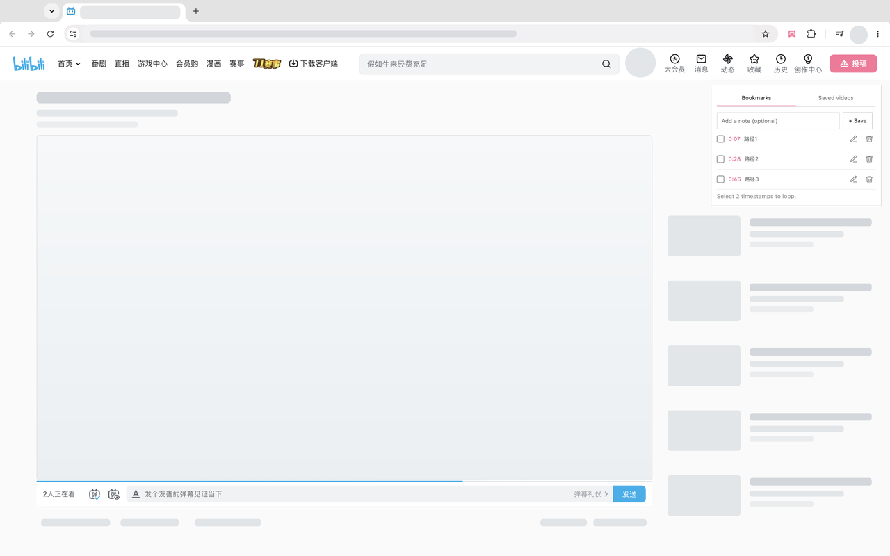
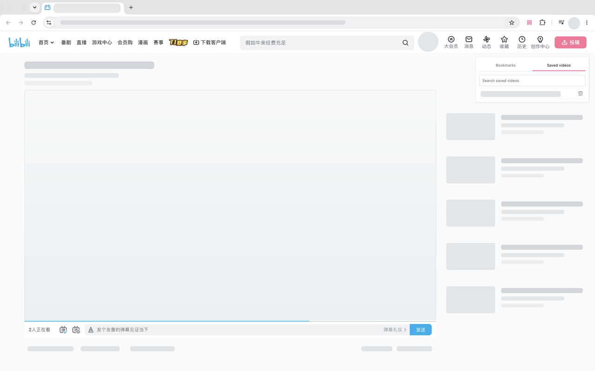
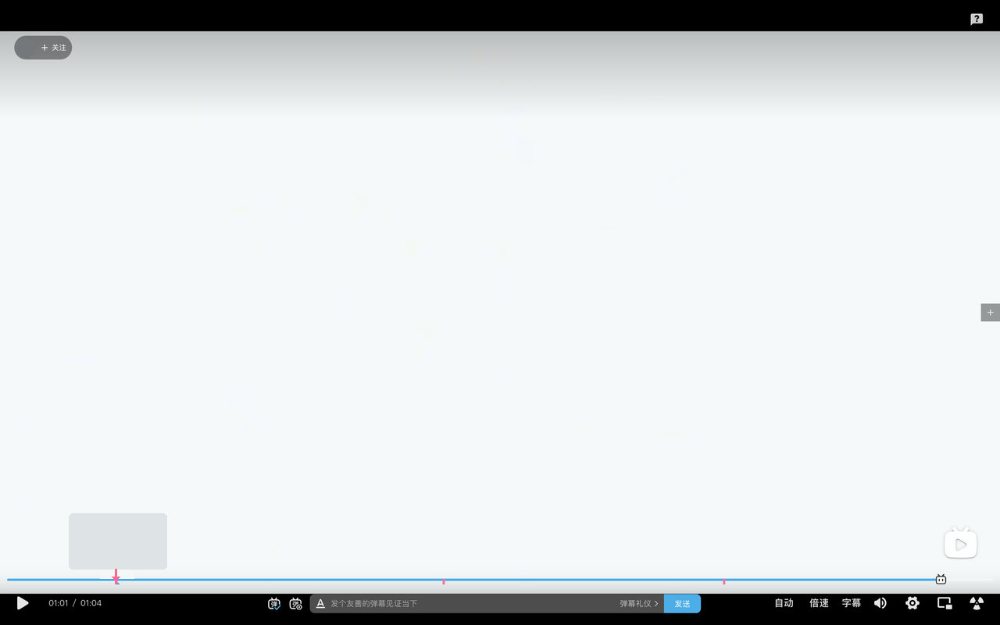

# Bilibili Timestamp Bookmarks

A minimal Chrome extension for saving, organizing, looping, and revisiting timestamps from Bilibili videos.

## Features

- Save the current timestamp with an optional note
- Jump back to saved timestamps
- Select two timestamps and loop between them
- Search and manage saved videos
- Delete bookmarks or saved videos in one click
- Use the extension in regular and fullscreen video players
- English and Simplified Chinese interface
- Light and dark theme support
- Sync bookmarks through Chrome extension storage

## Screenshots

## Install locally

1. Download or clone this repository.
2. Open `chrome://extensions` in Chrome.
3. Enable **Developer mode**.
4. Select **Load unpacked**.
5. Choose this repository folder.

The extension works on `bilibili.com`. Pin its icon to the Chrome toolbar for quick access.

## Privacy

The extension stores saved Bilibili video URLs, titles, timestamps, and optional notes using Chrome extension storage. It does not sell user data, run advertising analytics, or send saved bookmark data to the developer.

Read the complete [Privacy Policy](PRIVACY.md).

## Version

Current version: **1.0.2**

